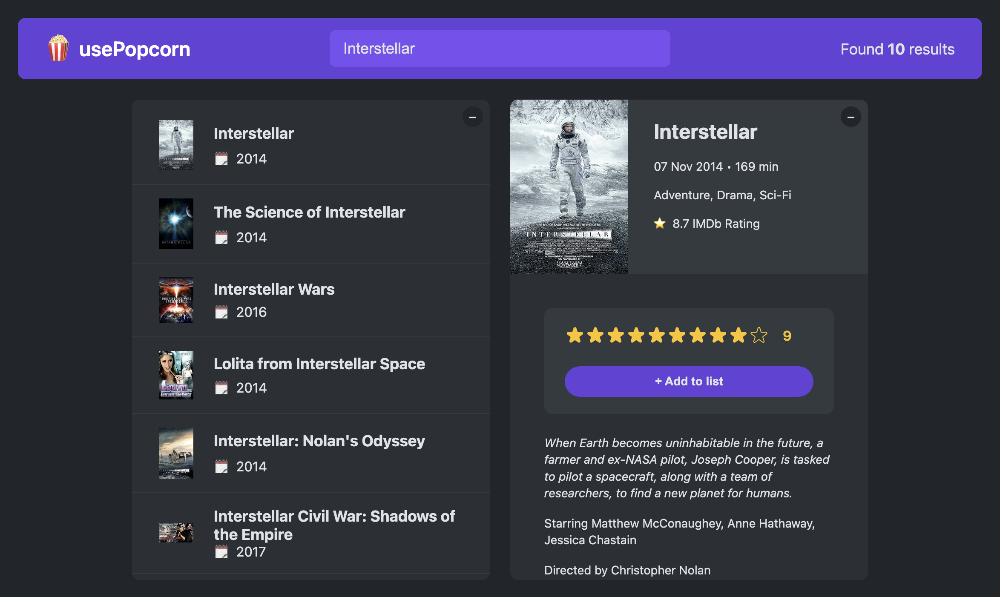
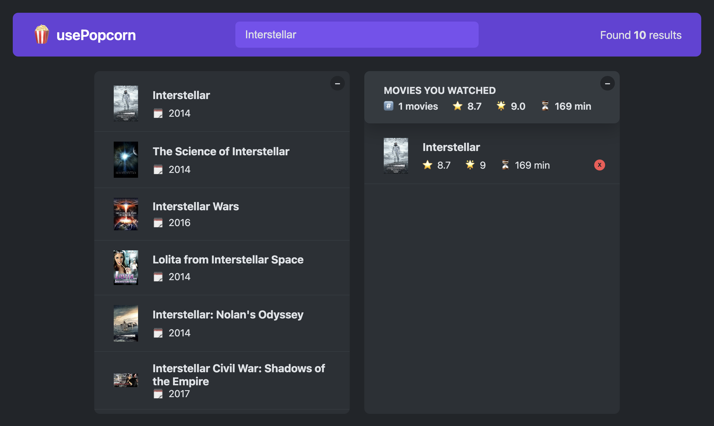

# usePopcorn




## Overview

usePopcorn is a React.js-based movie search and rating application that allows users to:

- Search for movies using the OMDB API
- View movie details
- Rate and add movies to a watched list
- Manage a personal watched movie list

## Features

- **Movie Search**: Fetches movie data from OMDB API.
- **Movie Details**: Displays runtime, genre, IMDB rating, and more.
- **User Ratings**: Users can add their own ratings.
- **Watched List**: Keeps track of watched movies.
- **Responsive UI**: Modern design with intuitive interactions.

## React Concepts Used

### 1. **Components**

The app is built using functional components to structure the UI efficiently. Key components include:

- `App`: Root component managing state and rendering the application.
- `MovieList`: Renders the list of movies based on search results.
- `MovieDetails`: Displays detailed information for a selected movie.
- `WatchedMoviesList`: Shows the list of watched movies.
- `NavBar`, `Search`, `Logo`, `NumResults`: Navigation and search UI elements.

### 2. **State Management (useState)**

- `useState` is used extensively to manage UI interactions, such as:
  - `query` for search input.
  - `movies` for search results.
  - `watched` for the list of watched movies.
  - `selectedId` for managing the selected movie.
  - `isLoading` and `error` for handling API states.

### 3. **Effect Hook (useEffect)**

- `useEffect` is used for:
  - Fetching movie details when a movie is selected.
  - Dynamically updating the page title based on the selected movie.
  - Listening for the Escape key to close movie details.

### 4. **Props**

- Components receive data via props to make them reusable and dynamic.
  - Example: `MovieList` receives `movies` and `onSelectMovie` as props to render search results dynamically.
  - `MovieDetails` gets `selectedId` to fetch and display details.

### 5. **Conditional Rendering**

- The UI adapts based on state changes:
  - If no movies are found, an error message is shown.
  - If a movie is selected, `MovieDetails` is rendered; otherwise, the watched list is displayed.
  - The "Add to list" button only appears when a user selects a rating.

### 6. **Event Handling**

- Click events are used to select movies and add them to the watched list.
- Input events update the search query dynamically.
- Keyboard events close the movie details on `Escape` key press.

## Installation

1. Clone the repository:
   ```bash
   git clone https://github.com/yourusername/usePopcorn.git
   ```
2. Navigate to the project folder:
   ```bash
   cd usePopcorn
   ```
3. Install dependencies:
   ```bash
   npm install
   ```
4. Start the development server:
   ```bash
   npm start dev
   ```

## Usage

- Type a movie name in the search bar to find movies.
- Click on a movie to view details.
- Rate a movie and add it to your watched list.
- View and manage your watched movies.

## API Key Setup

Replace `your api key` in the code with a valid OMDB API key to fetch movie data.

## Technologies Used

- **React.js** for UI development
- **OMDB API** for movie data
- **CSS** for styling

---

Enjoy using usePopcorn! 🍿
